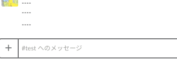

# slack-button-sample

Slack Button App Sample powered by serverless with NodeJS
<!-- One sentence about your product and what it dose.-->


## :pushpin: Description

### DEMO


## :white_check_mark: Features
<!-- list up your product features. -->
- :zap: build with serverless
- WIP :shirt: support eslint
- WIP :mouse: support editorconfig
- :black_joker: support jest
- WIP :arrows_counterclockwise: support CircleCI

---

## :floppy_disk: Install
### Requirements
<!-- show dependencies first -->
* yarn v1.10.1+
* node v8.10.0+
* serverless v1.32.0+

### Step
*1st: Create New Slack app*

cf. https://api.slack.com/slack-apps

Chosse `chat:write:bot` scope at OAuth & Permissions page,
you can install app your workspace.

Once install workspace, you can get OAuth Access Token(start with xox....)

*2nd: setting up .env*
```
$ touch .env
$ echo 'SLACK_TOKEN=xxx' >> .env
$ echo 'CHANNEL_ID=xxx' >> .env
```
you can find CHANNEL_ID in the URL when open Slack App with browser

*3rd: deploy app*
```
$ yarn deploy
```
deploy is started by serverless

copy endpoints url

*Lastly: setting reaction endpoints at Slack*

Open Slack App Admin page, put endpoints in Request URL at `Interactive Components`

## :arrow_forward: Usage
type like bellow
```
$ yarn invoke:button
```
button will be appear in target channel

## :information_source: Anything else
if you want to remove, type bellow
```
$ yarn remove-app
```

## :pencil: Author
[mesh1nek0x0](https://github.com/mesh1neko)

## :clipboard: LICENCE
MIT
